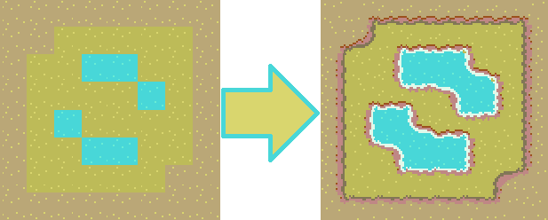
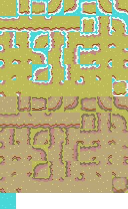
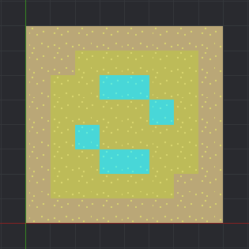
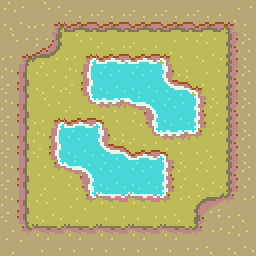

# Moku
Map utility/module for the Defold game engine.

Current Version: _Alpha v2.2_

### Thanks

Big thanks to Axel Hammerback for the Hero image and thumbnail :)

If you find a use for moku in a project, a quick shoutout to me may help immensely in my upcoming job search. It would therefore be greatly appreciated! (Also, I'd like to see how it's used)

### Documentation

[LDoc generated module documentation](http://htmlpreview.github.io/?https://github.com/Jrayp/Moku/blob/master/doc/index.html)

### Features: 

* Bitmask auto-tiling partially based on the method outlined here: [How to Use Tile Bitmasking to Auto-Tile Your Level Layouts](https://gamedevelopment.tutsplus.com/tutorials/how-to-use-tile-bitmasking-to-auto-tile-your-level-layouts--cms-25673). Supports both simple (4-bit) and complex (8-bit) auto-tiling. Can be used in conjuction with defold tilemaps, or your own custom, game-object based maps.
* AStar pathfinding with support for options such as heavy diagonals, different heuristics, etc
* Assorted convenience functions including cell picking

### Planned features

* Ability to calculate movement range based on tile weights (think tbs, or srpg's unit movement ranges) 
* _Possibly_ support for animating Defold tile maps

### State

Currently in alpha. Missing some features, and probably buggy. Things are still bound to change. Use at own risk.

NOTE: There is an updated rework branch that contains bug fixes, and uses a completely different method of organization. I do not have time to rewrite the documentation for that branch, so I am not merging it, but it is there (with updated LDoc documentation) if you would like to use it.

## Basics

A Moku map is nothing but a two-dimensional table of moku cells. A moku cell is a table of the form

```lua
moku_cell = {
    moku_x = i, -- Integer x coordinate of cell
    moku_y = j, -- Integer y coordinate of cell
    moku_id = k -- Integer tile id of cell
}
```

Of course there is nothing stopping you from adding elements to this table. Just be sure to not overwrite the coordinates or bad things will happen. 

### Moku Id's

The `moku_id` element of a moku cell is a reference to that cells tile "type" (ie walls, floors, forests, mountains). It is good practice to create a bookkeeping table of your tile types, as such:

```lua
local moku_ids = {
    WALL = 1,
    FLOOR = 2,
    WATER = 3,
    -- etc
}
```

Where the `number` value should correspond to that tiles tile sheet base image id (In the above example, the tilesheets first image would be a wall, and so on). The base image is the _first image corresponding to that tile type_. So in the case of auto-tiles, it is important to use the correct image id. This is explained in depth, in the auto-tile guide below.

**NOTE: Your Moku map cells should generally only have moku_id values that are also found in your moku_ids table!**

For example, given the above set of Moku id's, no cell in your moku map would have `moku_id` other than 1, 2 or 3.

By the way, I recommend making it convention to keep a reference of the `moku_ids` table on your moku map as such: `my_moku_map.moku_ids = moku_ids`, and to religiously use it as a way for setting Moku id's:

```lua
-- Moku cells are accessible using indexers
moku_map[i][j].moku_id = moku_map.moku_ids.WALL
```

### Creating a new Moku map

A new moku map can be created from scratch using `moku.new(width, height, tile_width, tile_height, on_new_cell)` or built from a Defold tilemap using `new_from_tm(tilemap_url, layer_name, tile_width, tile_height, on_new_cell)`. 

The optional `on_new_cell` parameter takes a function that is called once during creation for every Moku cell. This can be used to initialize the map to your liking by manipulating the Moku cells as you require. When `on_new_cell` is called, it passes an argument table with some useful information. An example follows

```lua
-- Sets all edge cells to the wall id
local function on_new_cell(args)
    -- The args table contains the following information
    -- args.cell, the current cell
    -- args.x, the current cells x coordinate
    -- args.y, the current cells y coordinate
    -- args.on_edge, whether or not the current cell is an edge cell

    if args.on_edge then
        args.cell.moku_id = moku_ids.WALL
    end
end
   
-- Create new moku map, and pass the on_new_cell function
my_moku_map = moku.new(8, 8, 32, 32, on_new_cell)
```

Note that there is no reason to set a cells `moku_x` or `moku_y` in the `on_new_cell` function. Moku does this before the function is even called.

### Bounds and Dimensions

Moku keeps track of "bounds" and "dimensional" data. Bounds here, is referring to a maps bottom left corner cell coordinate (negative coordinates are fully supported) and the maps width and height in cells. Dimensions on the other hand refer to world space dimensions in pixels, calculated from the bounds data and your entered tile sizes. Dimensional data is used for things such as cell picking etc. 

```lua
-- Prints the bottom left cells x, y coordinates
print(moku_map.bounds.x, moku_map.bounds.y)

-- Prints the maps width and height in cells
print(moku_map.bounds.width, moku_map.bounds.height)

-- Prints the tile width and height in pixels, as passed in the constructor
print(moku_map.dimensions.tile_width, moku_map.dimensions.tile_height)

-- Prints the maps total width and height in pixels
print(moku_map.dimensions.world_width, moku_map.dimensions.world_height)
```

### Internal data

Lastly Moku maps have an element 'moku_map.internal' which is meant for internal use (duh). Don't mess with it unless you know what you're doing :P

## Using the auto tiler



For this guide we will use 8-bit (Complex) tiling, but 4-bit (Simple) tiling works mostly the same way.

Please refer to [How to Use Tile Bitmasking to Auto-Tile Your Level Layouts](https://gamedevelopment.tutsplus.com/tutorials/how-to-use-tile-bitmasking-to-auto-tile-your-level-layouts--cms-25673) if in doubt, as Mokus auto-tiler is based on that article. 

This guide is fairly in-depth, but Moku auto-tiling is actually very simple (though fairly powerful) for most use cases. The biggest issue will likely be dealing with the tilesheet.

### Tile sheet layout

First, your sprite sheet containing your maps tile images must be in a specific layout. In the following tile sheet from the demo project, we have three base tile types: Plains, plateau, and ocean. (This is a modified version of the tile sheet used in the article linked above.) 



Since the plains and plateau types will be designated complex auto-tiles, they consist of a total of 48 individual images, each corresponding to a particular border configuration. Any tile you wish to designate a complex auto-tile must have 48 images reserved on your tile sheet in _exactly_ this order, beginning with what I will call the tiles "base image" (the image of a completely surrounded tile). 

Note that you may place your auto-tiles anywhere on your tile-sheet, as long as the following 47 images are in the correct order. Mokus incredibly advanced AI can handle this. 

The ocean tile does not require auto-tile functionality, and can be freely placed anywhere on your tile sheet.

Also note that if we were using simple tiling that everything would work the same, except that we would only require a more manageable 16 images per auto-tile. Following is the (much nicer) layout of a simple auto-tile tile-sheet for reference:


### Auto tiling a tilemap

In defold, add a tilemap to your collection that references a tile-source derived from your tile sheet. Go ahead and draw on it, but be sure to use only the above mentioned base tiles for drawing (that is the first image related to the tile type). 



Now, after importing moku in script, create a table of your tile types as such:

```lua
local moku = require "moku/moku"    

local moku_ids = {  
    -- Autotiles
    PLAINS = 1,
    PLATEAU = 49,
    -- Normal Tiles
    OCEAN = 97
}
```

It is recommended to give your tile types simple descriptive names (keys). The value associated with the type is a reference to that types base tile position on the tile sheet. Here the `PLAINS` types base tile occupies position `1` on the tile sheet, the `PLATEAU` type position `49`, and the `OCEAN` type position `97`. 

_**PROTIP:**_ It is possible to designate multiple Moku Ids using the same tile images as seperate auto-tiles, by using decimal values as such:

```lua
local moku_ids = {  
    PLAINS_1 = 1,
    PLAINS_2 = 1.1,
}
```

Create a Moku map from your defold tilemap. Assuming your tilemap is named `my_tilemap` with layer named `layer1`, and is attached to the gameobject `map_go`:

```lua
-- We will not be using the optional on_new_cell parameter, so its left blank
-- 32 is the width and height of our tile images
my_new_map = moku.new_from_tm("map_go#my_tilemap", "layer1", 32, 32) 
```

Now we tell moku to designate the `PLAINS` and `PLATEAU` types as auto-tiles:

```lua
-- moku.at_algorithm acts as an enum, and contains a reference to all auto-tiling algorithms
moku.set_autotile(my_new_map, moku_ids.PLAINS, moku.at_algorithm.COMPLEX, true, true, true, {moku_ids.PLATEAU})
moku.set_autotile(my_new_map, moku_ids.PLATEAU, moku.at_algorithm.COMPLEX, true, true, true)
```

Lets take a look at this functions parameters
1. Just takes the Moku map
2. The moku id you want to designate an auto-tile
3. What tiling algorithm to use, in this case we use complex 
4. Whether or not this tile interacts/joins with tiles of its own type, usually true
5. Whether or not this tile interacts/joins with the edge of the map
6. Whether or not this tile interacts/joins with empty cells (these are supported)
7. An optional list of other tile types that the auto-tile will interact/join to 

So in our example, the `PLAINS` type will interact/join with everything except `OCEAN` tiles; and the `PLATEAU` type will interact with everything except `OCEAN` and `PLAINS` tiles.

And now we can tell moku to tile the map:

```lua
moku.autotile_map(my_new_map)
```



That's it. Much more can be done, but this guide should be enough to at least get an idea of how Moku auto-tiling works, and should be sufficient for the vast majority of use cases. Refer to the demo project for advanced functionality. Following is the complete example code:

```lua
local moku = require "moku/moku"    

local moku_ids = {
    -- Autotiles
    PLAINS = 1,
    PLATEAU = 49,
    -- Normal Tiles
    OCEAN = 97
}

-- We will not be using the optional on_new_cell parameter, so its left blank
-- 32 is the width and height of our tile images
my_new_map = moku.new_from_tm("map_go#my_tilemap", "layer1", 32, 32) 

-- moku.at_algorithm acts as an enum, and contains a reference to all auto-tiling algorithms
moku.set_autotile(my_new_map, moku_ids.PLAINS, moku.at_algorithm.COMPLEX, true, true, true, {moku_ids.PLATEAU})
moku.set_autotile(my_new_map, moku_ids.PLATEAU, moku.at_algorithm.COMPLEX, true, true, true)

moku.autotile_map(my_new_map)
```
## Using the path finder

To use the path finder, simply call `local my_path = moku.find_path(map, start_cell, end_cell, cost_fn, cost_fn_args)`. This returns a list from the start, to the end cell, or nil if no path was found. The `cost_fn` argument is called every time the cost from moving one tile to another is required. When called, a table parameter named `args` is passed along with it, containing useful information. The `cost_fn_arg` argument is an optional argument you can pass, that will be added to the aforementioned `args` table (usually `self` references, I would assume). That's kind of a mouthful, so following is an example:
```lua
-- Tile cost bookkeeping
local tile_costs = {
    [moku_ids.FLOOR] = 1,
    [moku_ids.SLOW_ZONE] = 10, -- Higher values "cost" more to pass
    [moku_ids.WALL] = -1, -- Negative values count as impassable
    [0] = -1 -- nil tiles have moku_id = 0
    }

-- This function will simply return the value in the above table,
-- unless the end cell happens to fall in a "slow zone".
-- In that case we make nil tiles passable (at cost 1).
local function my_cost_fn(args)

    -- The args parameter contains following information
    --args.map --- The map passed to find_path
    --args.from_cell --- The cell being "left"
    --args.to_cell --- The cell being "entered"
    --args.start_cell --- The start cell passed to find_path
    --args.end_cell --- The end cell passed to find_path
    --args.user --- Whatever the user passed to cost_fn_args

    if args.to_cell.moku_id == 0 and args.end_cell.moku_id == args.map.moku_ids.SLOW_ZONE then
        return 1
    else
        return args.user[args.to_cell.moku_id]
    end

    return 

 end

-- Assuming my_map is a Moku map. 
-- (I would just add the tile_costs table to the moku map, but this is 
-- to demonstrate what the cost_fn_arg parameter can be used for)
local my_path = moku.find_path(my_map, some_cell, some_other_cell, my_cost_fn, tile_costs)

-- Prints the path coordinates and Moku id from start to end
if my_path then
    for _, cell in pairs(my_path) do
        print(cell.moku_x, cell.moku_y, cell.moku_id)
    end
end 
```

Additionally, it is possible to change some options that can dramatically affect the way the path finder works. These are accessed using `moku_map.pathfinder.OPTION` as follows:

```lua
-- The maximum number of cells to be searched. Negative values mean no bound.
moku_map.pathfinder.search_limit = -1

-- The directions that can be searched. Defaults to all 8 directions. moku.dir_tables has references to 
-- 3 "sensible" direction tables (ALL, CARDINAL, DIAGONAL), but you can add any table you want. 
moku_map.pathfinder.allowed_directions = moku.dir_tables.ALL

-- This punishes direction change by the amount given in the punish_direction_change_penalty
-- option. This can lead to straighter, less ugly paths under some conditions.
moku_map.pathfinder.punish_direction_change = false
moku_map.pathfinder.punish_direction_change_penalty = 5

-- Multiplies the cost of diagonal movement by the amount given in the heavy_diagonals_mult option. 
moku_map.pathfinder.heavy_diagonals = false
moku_map.pathfinder.heavy_diagonals_mult = 2.41

-- The heuristic used in the calculation. Moku offers a few built in under moku.heuristic.HEURISTIC
-- But you can add your own. This value is multiplied by the amount given in the heuristic_mult option
moku_map.pathfinder.heuristic = moku.heuristic.MANHATTAN
moku_map.pathfinder.heuristic_mult = 1
```
